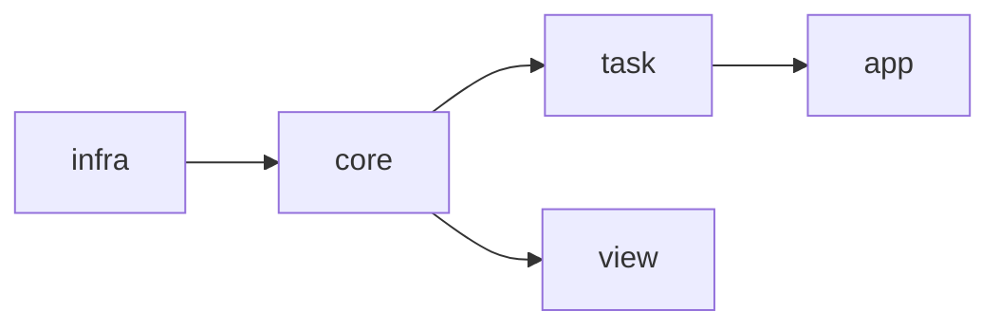

# プロジェクト構成
このプロジェクトは一方向の処理を行うというルールがある。

## infra
- dbの操作や外部サービスとの通信など担当する部門
- このinfraは他のディレクトリの実装に依存しない
- 他のディレクトリから使われるだけの純粋な関数の集まり
- DDDのinfraとは思想が違うので注意

## core
- infraを使ってデータを取得するや保存を行う
- 取得したデータを加工して意味のあるドメイン知識を持つデータに変換する
- また

## task
- coreの機能を組み合わせて、意味を持った一連の動作を行う。
- 他のtaskを呼び出さない純粋な関数の集まり

## app
- 複数のtaskを組み合わせて実行してビジネスロジックを表現する
- 基本的にユーザーはこれを呼び出すことになる

## view(未実装)
- coreによって取得されるデータを可視化する
